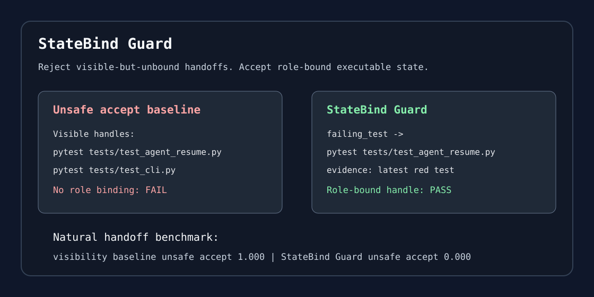

# StateBind Guard

[](https://github.com/FU-max-boop/statebind-guard/actions/workflows/smoke.yml)
[](https://github.com/FU-max-boop/statebind-guard/releases)
[](LICENSE)

**Project page:** https://fu-max-boop.github.io/statebind-guard/
**Launch note:** [Visible context is not executable state](docs/launch_note.md)

StateBind Guard is a small benchmark and checker for a simple failure mode in
coding-agent handoffs:



> A handoff can contain the right identifier and still fail if it does not preserve the binding from active target to semantic role to executable handle.

For long-running coding agents, the basic memory unit should not only be a chunk or a summary. It should preserve executable bindings such as:

```text
active PR -> comparison-base role -> exact commit SHA
active task -> failing-test role -> exact pytest selector
active patch -> current-file role -> exact file path
```

This repository packages four things:

1. **Benchmark artifact**: seed and natural-handoff snippets, baselines, result cards, and tests.
2. **Practical handoff tool**: a Codex-compatible `statebind-handoff` skill plus a lightweight local script for generating and checking executable handoffs.
3. **CI-ready validator**: a dependency-free `statebind` CLI that emits structured findings for versioned `statebind.json` contracts.
4. **GitHub Action**: a composite action that validates handoff contracts and writes JSON/SARIF reports for CI and code scanning.

## Why This Matters

Coding agents increasingly resume work from summaries, retrieval contexts, memory files, and tool traces. These handoffs often preserve narrative context but lose operational state: the next agent may know what happened but not exactly which file, command, commit, PR, issue, or artifact to act on.

StateBindBench turns this into an interaction-aware evaluation target for human-centered coding agents:

```text
Can the next agent preserve the executable binding needed to act safely?
```

## 5-Minute Proof Gate

For a quick technical screen, this repository should answer three questions:

1. Can the artifact be run locally?
2. Does it expose a concrete agent failure mode?
3. Does it state the boundary of the claim?

Run:

```bash
bash scripts/run_smoke_test.sh
make benchmark
```

Then inspect:

- [launch note](docs/launch_note.md)
- [quick demo](docs/quick_demo.md)
- [failure cases](docs/failure_cases.md)
- [limitations](docs/limitations.md)

## Quick Start

Add StateBind Guard to any repository in about 30 seconds:

```bash
python -m pip install "git+https://github.com/FU-max-boop/statebind-guard.git@v0.1.1"
statebind init --goal "keep coding-agent handoffs executable" --next-command "make test"
git add HANDOFF.md statebind.json .github/workflows/statebind-guard.yml
```

This creates a ready-to-run handoff contract and a GitHub Actions workflow that
publishes JSON/SARIF validation reports on future pushes and pull requests.

Run the smoke demo:

```bash
bash scripts/run_smoke_test.sh
```

Run the local quality checks:

```bash
make test
make benchmark
make public-check
```

See [quick demo](docs/quick_demo.md) for the benchmark result summary and
[GitHub Action usage](docs/github_action_usage.md) for a CI smoke gate example.

Use it directly in a GitHub workflow:

```yaml
- uses: FU-max-boop/statebind-guard@v0.1.1
  with:
    handoff: HANDOFF.md
    statebind-json: statebind.json
    fail-on: warning
```

Install the CLI locally:

```bash
python -m pip install -e .
statebind demo
```

Generate and validate a machine-readable handoff:

```bash
statebind extract \
  --repo . \
  --transcript examples/codex-handoff-demo/transcript.md \
  --repo-label . \
  --transcript-label examples/codex-handoff-demo/transcript.md \
  --out HANDOFF.md \
  --json statebind.json

statebind validate statebind.json \
  --repo . \
  --fail-on error \
  --report statebind-validation.json \
  --sarif statebind-validation.sarif
```

Install the local Codex skill:

```bash
bash scripts/install_codex_skill.sh
```

Then ask Codex:

```text
Use statebind-handoff to create a HANDOFF.md for this coding task.
```

## Repository Layout

```text
action.yml                              # reusable GitHub composite action

statebind_handoff/
  statebind_handoff.py               # dependency-free handoff helper

integrations/codex-skill/
  statebind-handoff/                 # installable Codex skill

examples/
  visible-id-unbound/                # minimal mechanism demo
  codex-handoff-demo/                # toy transcript for handoff generation

docs/
  case_studies/
  industrial_adoption.md
  failure_cases.md
  github_action_usage.md
  handoff_contract.md
  launch_note.md
  limitations.md
  quality_gates.md
  quick_demo.md
  result_cards/
  research_brief.md

schemas/
  statebind.schema.json              # versioned machine contract

data/
  statebind_guard_seed_benchmark.json
  statebind_guard_natural_handoff_benchmark.json
  statebind_guard_failure_corpus.json
```

## Use With Codex

Generate a draft handoff from a transcript and current repo state:

```bash
python statebind_handoff/statebind_handoff.py extract \
  --repo . \
  --transcript examples/codex-handoff-demo/transcript.md \
  --repo-label . \
  --transcript-label examples/codex-handoff-demo/transcript.md \
  --out HANDOFF.md \
  --json statebind.json
```

Check a handoff:

```bash
python statebind_handoff/statebind_handoff.py check HANDOFF.md
```

Validate the machine-readable contract:

```bash
python statebind_handoff/statebind_handoff.py validate statebind.json --repo . --json
```

Print the JSON schema:

```bash
python statebind_handoff/statebind_handoff.py schema
```

Print the core visible-but-unbound demo:

```bash
python statebind_handoff/statebind_handoff.py demo
```

Run the benchmarks:

```bash
make benchmark
```

The included seed and natural-handoff benchmarks evaluate whether a checker can
reject handoffs that mention the right file, command, PR, test, artifact, or SHA
but fail to bind it to the active role. On the included real-shaped snippets,
`statebind_guard` beats both visibility and keyword-role baselines and reduces
unsafe accepts.

The larger failure corpus adds coverage across wrong-file, wrong-test,
wrong-commit, wrong-PR, stale-artifact, config/environment, dataset-version,
run-ID, branch-name, risky-command, and multi-binding failures. See
[failure corpus result card](docs/result_cards/statebind_guard_failure_corpus.md)
and the [schema/report upgrade case study](docs/case_studies/schema_report_upgrade.md).

## What StateBind Is And Is Not

StateBind is an executable handoff contract:

```text
active target -> semantic role -> executable handle
```

It is not a claim that retrieval always fails. Retrieval can work when the active record and executable handle are cleanly exposed. The claim is narrower: relevance and visibility are insufficient metrics for reliable agent handoff because they do not guarantee that the next agent has preserved the action-relevant binding.

## Quality Gates

The artifact is checked against five practical gates:

1. **Research gate**: the thesis is legible and does not overclaim.
2. **Tool gate**: a user can generate and check a handoff in minutes.
3. **Evidence gate**: each binding has role, handle, evidence, confidence, and risk.
4. **Public-release gate**: no obvious local paths, secrets, or accidental generated files.
5. **Outreach gate**: the README, brief, examples, and slides make the work discussable.

See `docs/quality_gates.md` for the full checklist.

## Current Status

This repository is a public tool/benchmark release. It intentionally excludes
paper PDFs, review packages, and large raw supplements.

## Future Directions

- Fully natural deployed-agent handoff corpus.
- Learned StateBind construction from messy traces.
- Binding-aware memory interfaces for coding agents.
- Integration with Codex, Claude Code, OpenHands, and repository RAG systems.
- Safety evaluation for wrong-object coding-agent actions.
